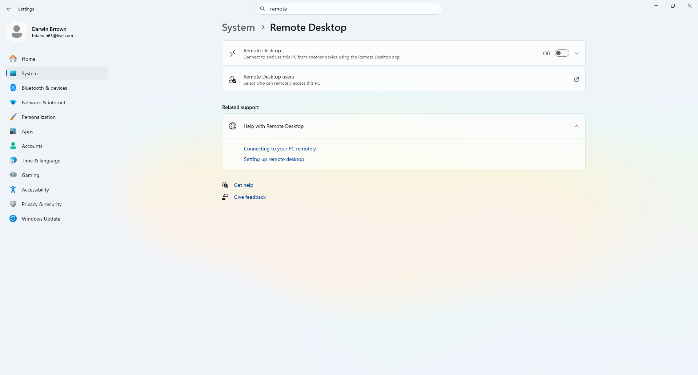
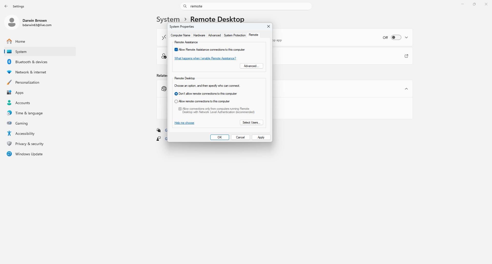
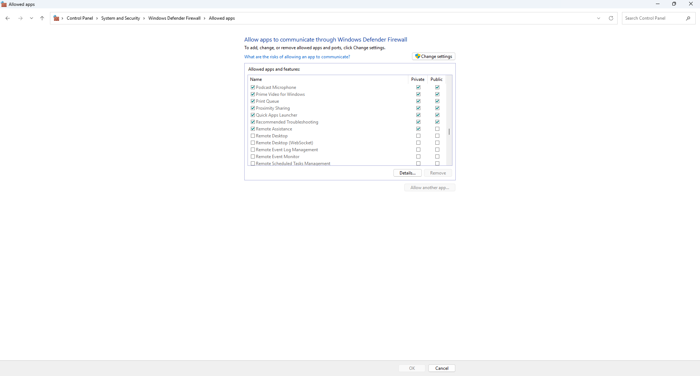
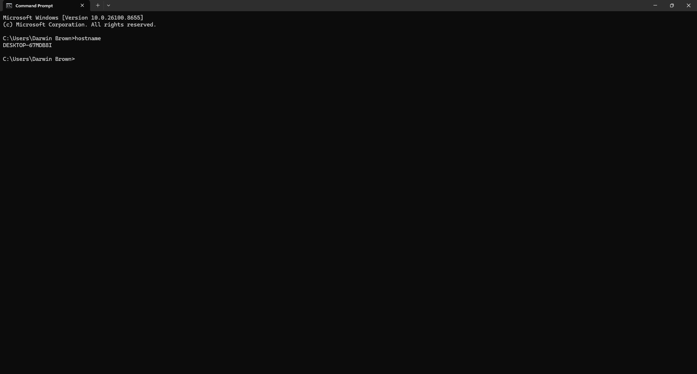
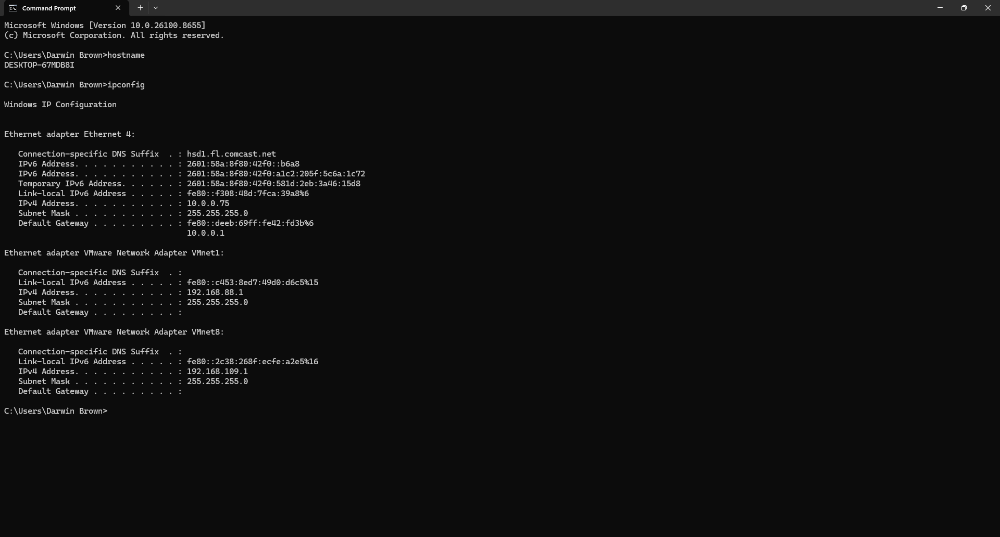
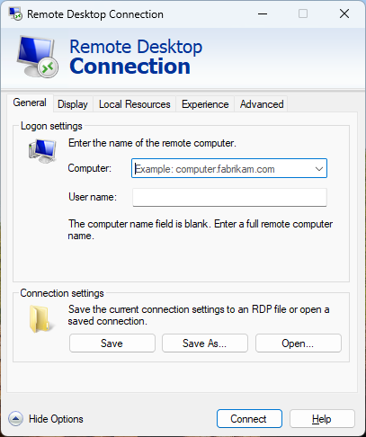
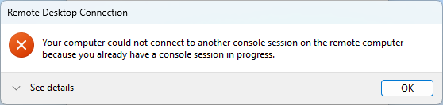
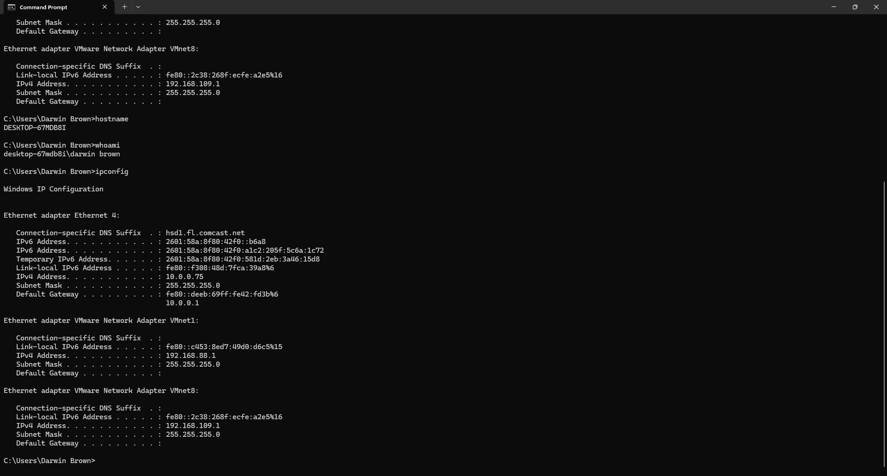

# Darwin Remote Desktop Troubleshooting Lab

## Overview

This project demonstrates common Remote Desktop (RDP) troubleshooting procedures performed by Help Desk and IT Support professionals in a Windows 11 environment.

The lab covers verifying Remote Desktop settings, reviewing system configuration, identifying the computer hostname, checking IP configuration, testing Remote Desktop connectivity, investigating connection errors, and documenting the troubleshooting process.

---

## Objectives

- Verify Remote Desktop configuration
- Review System Properties for Remote Desktop
- Identify the local computer hostname
- Verify IP configuration
- Launch the Remote Desktop client
- Troubleshoot Remote Desktop connection errors
- Document the troubleshooting process
- Verify the final system configuration

---

## Technologies Used

- Windows 11
- Remote Desktop (RDP)
- Windows Settings
- System Properties
- Command Prompt
- TCP/IP Networking
- Windows Defender Firewall

---

## Skills Demonstrated

- Help Desk Troubleshooting
- Remote Desktop Support
- Windows Administration
- Network Troubleshooting
- IP Configuration Verification
- Hostname Identification
- Command Line Diagnostics
- Technical Documentation

---

## Lab Steps

### 1. Verify Remote Desktop Settings

Verified the current Remote Desktop configuration using the Windows Settings application.



---

### 2. Review System Properties

Opened the Remote tab within System Properties to review Remote Desktop and Remote Assistance settings.



---

### 3. Windows Defender Firewall

Verified that **Remote Desktop** was allowed through Windows Defender Firewall to ensure remote connections are permitted.



---

### 4. Identify the Computer Hostname

Verified the computer hostname using Command Prompt.

**Command Used**

```cmd
hostname
```



---

### 5. Verify Network Configuration

Displayed the current IP configuration to verify network connectivity.

**Command Used**

```cmd
ipconfig
```



---

### 6. Launch Remote Desktop Client

Opened the Microsoft Remote Desktop Connection client.

**Command Used**

```cmd
mstsc
```



---

### 7. Troubleshoot Remote Desktop Connection

Attempted an RDP connection and documented the resulting connection error for troubleshooting purposes.



---

### 8. Final Verification

Verified the computer hostname, current user, and network configuration after completing the troubleshooting process.

**Commands Used**

```cmd
hostname
whoami
ipconfig
```



---

## Key Takeaways

- Verified Remote Desktop configuration
- Reviewed Windows System Properties
- Identified the local computer hostname
- Verified network configuration using Command Prompt
- Launched the Remote Desktop client
- Documented a Remote Desktop connection error
- Practiced common Tier 1 Help Desk troubleshooting techniques
- Improved Windows administration and networking skills

---

## Repository Structure

```text
README.md

screenshots/
├── 01-remote-desktop-settings.png
├── 02-system-properties-remote.png
├── 03-control-panel.png
├── 04-hostname.png
├── 05-ipconfig.png
├── 06-remote-desktop-client.png
├── 07-rdp-connection-error.png
└── 08-project-complete.png
```

---

## Author

**Darwin Brown**
